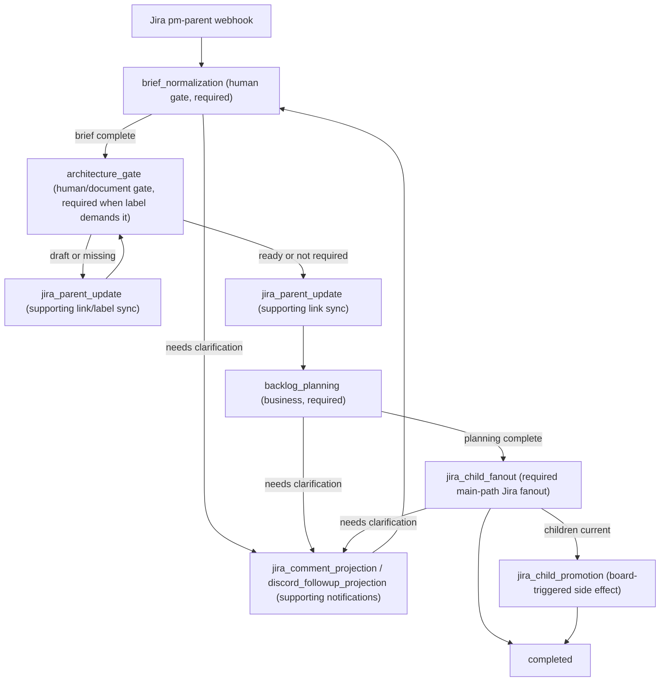

# Parent Planning Workflow Design And Implementation Review

## Purpose

Parent Planning turns a Jira `pm-parent` issue into executable engineering work while keeping ownership boundaries clear:

- Jira is the execution and collaboration surface.
- Architecture documents are persistent knowledge and live in the configured architecture docs provider.
- Platform storage owns normalized brief state, workflow execution state, attempts, telemetry, and audit.
- Engineering child tickets are the executable work units.

The workflow must make progress durably, expose every real work step through persisted attempts, and never infer or invent state in the UI.

## Non-Negotiable Invariants

- Workflow semantics are defined in code by decorated deterministic methods, not by editable database catalogs.
- Every UI-visible operation that performs runtime work or external side effects runs inside a real `WorkflowOperationAttempt`.
- Operation-scoped telemetry and audit events must carry the persisted `attempt_id`.
- Jira descriptions remain human-authored input. Normalized state is stored in platform storage and architecture docs, not by rewriting the issue body.
- Clarification questions are stateful turns. A reply must answer the active question set before the workflow asks the next question.
- Retry is exposed only when a registered executable retry capability exists for that operation.
- No fallback paths, compatibility readers, synthetic attempts, or silent degradation are allowed.

## Expected Use Case

### Admission

A Jira webhook is received for a `pm-parent` issue. The workflow should ignore unrelated Jira events and create or resume one `parent_planning:<issue-key>` execution for valid parent issues.

The execution source is the Jira issue key. The Jira issue remains the human entry point and should link out to the workflow execution and architecture document.

### Brief Normalization

The first product gate is `brief_normalization`.

Expected behavior:

- Load the parent issue summary, description, labels, and relevant context.
- Normalize the parent issue into a typed product brief using the PM runtime.
- Persist the normalized brief in platform storage when complete.
- If the PM runtime needs clarification, mark the brief gate `waiting_for_input`.
- Publish the exact active questions to Jira and configured follow-up channels.
- Do not proceed to backlog planning while the brief gate is waiting.

### PM Clarification Reply

When a human replies on the active Jira clarification thread:

- The reply is attached to the active PM interview case.
- The PM runtime continues that same turn.
- If the brief is still incomplete, the workflow updates the active question set and remains waiting.
- If the brief is complete, the workflow completes `brief_normalization` and continues.
- The system must not treat the reply as unrelated source material and generate a new unrelated question.

### Architecture Gate

If the parent issue requires architecture:

- Resolve or create the configured architecture document.
- Link the document from Jira.
- Block planning until the architecture document is marked ready.
- Show the architecture gate as a first-class blocking state if it can stop the workflow.

Architecture work is real work when it creates or updates a document or Jira link. That work must be attempt-backed.

### Parent Reference Sync

The workflow syncs parent Jira metadata without changing the user-authored description.

Expected side effects:

- Upsert workflow execution link.
- Upsert architecture document link when present.
- Apply sync labels only as explicit side-effect operations.

This is supporting work. It must not be displayed as product progress, but failures must still be visible and retryable if the side effect can be re-run.

### Backlog Planning

`backlog_planning` is a must-finish business step.

Expected behavior:

- Run only after the brief is complete and required architecture is ready.
- Use the confirmed brief and architecture context.
- Produce a typed planning package.
- Validate model output contracts before downstream side effects.
- If product input is missing, wait for input and publish the precise questions.
- If the planner returns an invalid contract, the runtime retries the stage according to the workflow retry policy before failing the operation.

### Engineering Child Fanout

`jira_child_fanout` is a must-finish step because it creates or refreshes the engineering child tickets that make the parent executable.

Expected behavior:

- Run only after `backlog_planning` completes.
- Create or refresh Jira engineering child tickets from typed child specs.
- Preserve parent-child relationships in Jira as subtasks or the configured child issue relationship, not as arbitrary linked work items.
- Emit Jira request/response telemetry under the fanout attempt.
- If fanout needs product clarification, mark the fanout attempt waiting and publish the active questions.

Although this step uses Jira, it is part of the main product path. The UI must not treat it as optional supporting work.

### Material Parent Updates

When a material parent issue field changes:

- Re-normalize the brief from the updated Jira source.
- Re-check architecture readiness.
- Refresh existing child tickets from the updated planning package.
- Mark stale child work blocked until refresh completes.
- Preserve the original Jira description and keep normalized state in platform storage.

### Board Promotion

When the parent enters the configured board state:

- Load current engineering children.
- Promote child tickets to the configured target status.
- Record one attempt for the promotion side effect.
- Fail the operation if any required child promotion fails.

### Completion

The workflow is complete only when all required main-path steps are complete and no active clarification or required architecture gate is blocking progress.

## Expected Workflow Graph

## Current Code Comparison

| Area | Expected design | Current code | Status |
| --- | --- | --- | --- |
| Code-defined semantics | Parent graph is inferred from decorators and DB stores execution state only. | `ParentFeaturePlanningWorkflow` uses `@workflow_step` and `workflow_type_catalog` registers it through `infer_workflow_steps`. | Meets direction. |
| Graph order | UI graph should reflect the product path: brief, architecture gate, parent sync, backlog planning, fanout, promotion, supporting projections. | `infer_workflow_steps` sorts by key before topological ordering, producing `brief_normalization`, `backlog_planning`, `discord_followup_projection`, `jira_child_fanout`, `jira_child_promotion`, `jira_comment_projection`, `jira_parent_update`, `notification_emit`. | Gap. The graph order is mechanically sorted, not author-intent ordered. |
| Engineering child fanout | Must-finish main-path step. | `jira_child_fanout` is `required=True` but `kind=INTEGRATION`, so UI grouping can treat it as supporting infrastructure instead of main progress. | Gap. Required integration needs first-class main-path rendering or a business kind. |
| Architecture gate | First-class blocking gate when architecture is required. | Architecture readiness is checked inside issue-created/update/follow-up handlers. There is no decorated `architecture_gate` step. | Gap. The UI cannot show architecture as the reason the main path is blocked. |
| Architecture document creation | Attempt-backed if it creates Confluence/internal docs or links. | `resolve_architecture_gate` can create internal or Confluence docs before any explicit architecture operation attempt exists. | Gap. Real external/document work can happen outside a workflow step attempt. |
| Parent Jira update | Supporting side effect with clear action semantics. | One `jira_parent_update` operation is reused for link sync, sync labels, and marking parent/children sync-blocked. | Gap. One operation type represents multiple side-effect contracts, making retries and telemetry ambiguous. |
| Notification emit | UI-visible steps must represent real executable work. | `notification_emit` is registered as a step but has no observed execution path in parent planning. | Gap. Remove it from the parent graph or implement the real operation. |
| Brief normalization | Attempt-backed PM runtime call that waits on clarification when needed. | `_resolve_product_brief_step` starts an attempt, passes attempt context to the planner, and waits/completes the attempt. | Meets direction. |
| PM reply handling | Reply continues the active PM interview and advances the same workflow. | `handle_pm_interview_reply` resolves active clarification context, continues the PM interview, persists completed brief, and advances the parent workflow with `_mb_pm_interview_followup`. | Mostly meets direction; needs trace tests for “question asked -> reply received -> same question set resolved”. |
| Clarification publishing | Projection attempts exist when new Jira/Discord publication work is performed. | `_ensure_clarification_with_projection_attempts` starts Jira and Discord projection attempts for new publication, but returns without attempts when active clarification already exists. | Acceptable only if no external work is performed; needs test coverage to prove no side effect happens on the no-op path. |
| Backlog planning | Required business step, validates typed planner output, waits on product questions. | `_plan_and_seed_with_attempts` starts a planning attempt and waits if planning is incomplete. Contract validation exists in runtime payload models and tests. | Meets current direction. |
| Material parent updates | Re-plan and refresh child tickets from updated parent context. | `_handle_issue_updated` refreshes brief and existing child tickets through `refresh_parent_children`, but it does not run a visible `backlog_planning` attempt for the updated planning package. | Gap. Parent update planning and child refresh are collapsed into fanout. |
| Child promotion | Board-triggered side effect is attempt-backed and failure-visible. | `_handle_board_entry` starts `jira_child_promotion`, transitions child tickets, and fails the attempt if any child promotion fails. | Mostly meets direction. It is not retryable despite being an external side effect. |
| Retry exposure | UI retry capability must match registered executable retry handlers. | Read model now intersects step retry metadata with installed retry capabilities; parent retry supports parent update, backlog planning, and child fanout. | Meets recent fix for those steps. |
| Live telemetry | Drawer should use one open operation telemetry stream. | Execution page now consumes the operation stream directly and derives attempt views from streamed rows. | Meets recent fix. |

## Design Gaps To Fix Before Calling Parent Planning Complete

1. Add a first-class `architecture_gate` workflow step or remove architecture gating from the visible workflow contract. Because it blocks planning and can create documents, it should be explicit and attempt-backed.
2. Fix graph ordering so decorators express author intent. Sorting step keys is not an acceptable product workflow model.
3. Reclassify or render `jira_child_fanout` as a required main-path step. It is not optional supporting work.
4. Split overloaded `jira_parent_update` side effects into precise operations or add a typed action model that makes retry and telemetry semantics unambiguous.
5. Remove `notification_emit` from the parent workflow unless there is a real executable parent notification operation.
6. Make material parent update run a visible planning refresh attempt before child refresh when planning can change.
7. Decide whether `jira_child_promotion` is retryable. If it is user-visible and can fail on Jira, it should have a registered retry executor or not expose retry metadata.
8. Add trace-level tests for the full parent path: create parent, ask PM question, answer same question, architecture blocked, architecture ready, backlog planning, fanout, material update, and board promotion.

## Verdict

The implementation is closer to the intended durable workflow architecture than the previous DB-authored model, but Parent Planning is not yet design-complete. The largest remaining mismatch is that the code-defined graph currently describes operations, not the product workflow semantics the UI and users need to understand.
